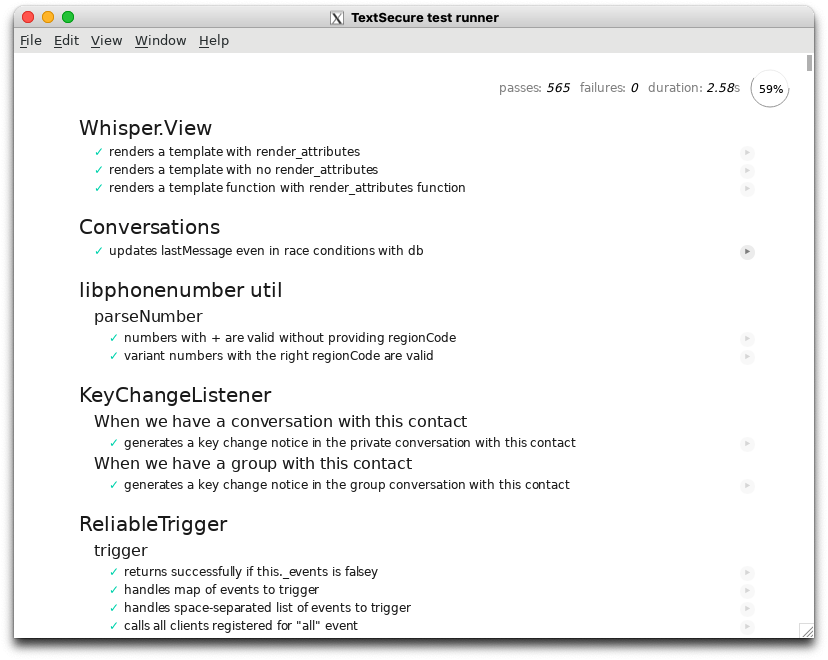

# sqat-testing

A testing repo that launched several tests on signal project.

## Usage

To perform internal module testing.

Conducting static and dynamic tests on [Signal-Desktop](https://github.com/signalapp/Signal-Desktop).

We're using [Docker](https://www.docker.com/) to install the pre-requisites specified in the [CONTRIBUTING.md](https://github.com/signalapp/Signal-Desktop/blob/development/CONTRIBUTING.md).

## Getting started

Since [Signal-Desktop](https://github.com/signalapp/Signal-Desktop) is an electron app, it needs to run with a windows display server like X. Therefore, to make it runnable in a docker container we have to do some configuration as docker does not handles GUI by default. Since X is native to Linux, Mac and Windows users will need to install a separate X server.

### Set Up X Windows Server

#### Mac

```sh
# this will install the xquartz x server
brew install xquartz
```

Then, you'll have to setup XQuartz to allow network windowing requests

1. Launch XQuartz. Under the XQuartz menu, select Preferences
2. Go to the security tab and ensure "Allow connections from network clients" is checked.
3. Restart XQuartz.

Then, run `xhost +localhost` to allow connections from localhost

For a more detailed version, see [Docker X11 on MacOS](https://gist.github.com/paul-krohn/e45f96181b1cf5e536325d1bdee6c949)

#### Windows

Download [VcXsrv](https://sourceforge.net/projects/vcxsrv/) and install it like a normal application

After that open VcXsrv from your start menu, it will prompt a installation-like window, just click next and ensure that these 2 options are left unchecked:

- Native opengl is left unchecked
- Disable access control is checked

For a more detailed version, see [Running ROS with GUI in Docker using Windows Subsystem for Linux 2 (WSL2)](https://marinerobotics.gtorg.gatech.edu/running-ros-with-gui-in-docker-using-windows-subsystem-for-linux-2-wsl2/)

#### Linux

Depends on which distro you're on if you're using X as the windows server, then you're good to go

After setting up the X server, then the later part would be more straightforward.

### Configure Docker to forward the X requests

So, at this point you have two choice

1. Pull the pre-built images from [](https://hub.docker.com/repository/docker/marcustut/sqat)
2. Build the image locally

Either works fine, of course if your internet connection is slow, building it locally will often be faster.

To pull the pre-built images run the following:

```sh
# this will pull the latest image eg. 0.1.3 at the time of writing
docker pull marcustut/sqat
```

To build the image locally

```sh
# `-t` will tag the image with a name and the [:<tag>] is optional
# `.` is specifying the Dockefile at current directory
# eg. docker build -t marcustut/sqat:0.1.3 .
docker build -t <hub-username>/<repo-name>[:<tag>] .
```

After pulling / building the image, verify that the image is available by running

```sh
docker images

# You will see something like the following
# SAMPLE OUTPUT:
REPOSITORY        TAG         IMAGE ID       CREATED             SIZE
marcustut/sqat    0.1.3       7eaf50a283eb   About an hour ago   5GB # <- this is the image you just pulled or built
oracle/database   18.4.0-xe   204843b585ca   7 days ago          5.89GB
node              14.16.0     abea835c0b3b   3 months ago        943MB
```

Either way, after you have the image, here comes the most important part, run the image in a container.

So I recommend just use the following command in the project root to avoid any weird issues

```sh
# for mac
docker run -d -e DISPLAY=host.docker.internal:0 --name sqat --security-opt seccomp=chrome.json marcustut/sqat:0.1.3

# for windows
docker run -d -e DISPLAY=host.docker.internal:0.0 -e LIBGL_ALWAYS_INDIRECT=0 --name sqat --security-opt seccomp=chrome.json marcustut/sqat:0.1.3

# Note that `marcustut/sqat:0.1.3` is the image name here, so if you have a different version or name just change it
# Note that remember to run with the --security-opt flag, this is to give allow the guest os permissions for Chromium and this is required
```

After this, verify that the container is actually running by running `docker ps`, you should see something like the following

```sh
CONTAINER ID   IMAGE                  COMMAND                  CREATED          STATUS          PORTS     NAMES
58958cea1171   marcustut/sqat:0.1.3   "docker-entrypoint.s…"   34 minutes ago   Up 34 minutes             sqat
```

Now, you're almost there, all you have to do is run a shell inside the container and build the project and run the tests

```sh
# This will open a 'bash' session within the container
# by default, you'll be connecting as user 'sqat', you can verify with `whoami`
# eg. docker exec -it 58958cea1171 /bin/bash
docker exec -it <container_id> /bin/bash

# in case you need to connect as a root user
# eg. docker exec -u 0 -it 58958cea1171 /bin/bash
docker exec -u 0 -it <container_id> /bin/bash
```

Now, when you're in the container, the project folder should be at '/sqat/Signal-Desktop', again you can verify this with `pwd`

Since the project dependencies are all installed during the docker build, you can straight building the project by running

```sh
# This will build the project
# note: this will take a while
yarn grunt && yarn build:webpack
```

## Running tests

For this project, there's actually two tests, one is the local node server and the other is the actual electron app

```sh
# this will run both the tests
yarn test

# this will run tests on the node server
yarn test-node

# this will run tests on the electron app
yarn test-electron
```

if `yarn test-node` ran successfully you should see terminal output something like the following

```sh
...
  waitBatcher
    ✓ should schedule a full batch
    ✓ should schedule a partial batch
Flushing start test for waitBatcher items.length=1
Flushing complete test for waitBatcher
    ✓ should flush a partial batch
Flushing start test for waitBatcher items.length=1
Flushing complete test for waitBatcher
    ✓ should flush a partial batch with new items added

  both/util/webSafeBase64
    ✓ roundtrips with all elements
    #toWebSafeBase64
      ✓ replaces +
      ✓ replaces /
      ✓ removes =
    #fromWebSafeBase64
      ✓ replaces -
      ✓ replaces _
      ✓ adds ===
      ✓ adds ==
      ✓ adds =


  920 passing (2s)
  4 pending
  6 failing
...
```

don't worry about the few failed test cases, it's just some permissions problems for file access, it's not related to us

if `yarn test-electron` ran successfully you should see a window popping up and all the test cases pass like the following



For a more detailed docs, see [Official Signal CONTRIBUTING Docs](https://github.com/signalapp/Signal-Desktop/blob/development/CONTRIBUTING.md)

## Running the application

```sh
# this will run the signal app
yarn start
```
