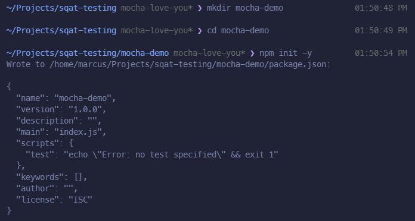
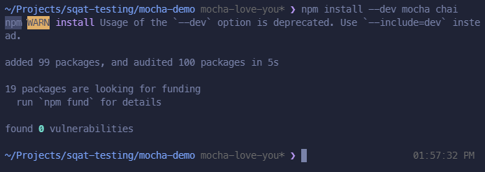
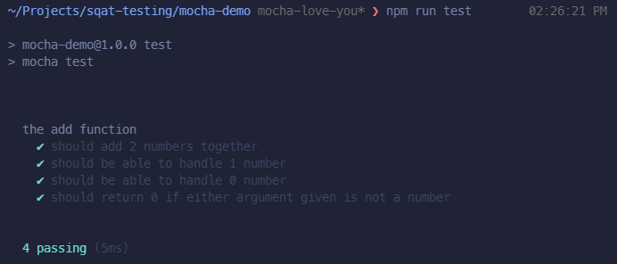
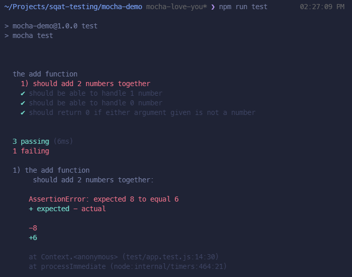

# Mocha Demo

### Pre-requisite

Since Mocha is a JavaScript testing framework for both Node.js and the Browser, therefore in order to demonstrate it we need to set up a basic Javascript project. In this case we will use NPM (Node Package Manager).
I am doing this in a linux environment, a lot of the things still apply to both Mac and Windows.

#### Project setup

We will first need to create a new folder, we can do that by opening a terminal window and enter the below commands

```sh
# Create a new folder named 'mocha-demo'
mkdir mocha-demo

# Go into the directory
cd mocha-demo

# Initialize a node.js project
# the '-y' flag here will say yes to all questions asked by npm
npm init -y
```

If everything is successful, you will look something similar to the following screenshot



#### Install dependencies

Since we'll be using Mocha, we have to install it to our project as a dependency. Notice here we also installed Chai, it is an assertion library that is used in conjunction with Mocha to test our functions later on.

```sh
# Install 'mocha' and 'chai' as development dependencies
npm install --dev mocha chai
```



#### Writing a function to test 

Now, let's write a function so that we can test it. Create a file at `src/app.js` or you can do it from the command line

```sh
# Create a 'src' folder
mkdir src

# Go into the folder and create a file 'app.js'
cd src && touch app.js
```

We'll write a basic add function which takes two numbers and return their sum as follow:

```js
const add = (a = 0, b = 0) => {
    // Check if the variable are number, else return 0
    if (typeof a !== 'number' || typeof b !== 'number') {
        return 0;
    }

    // return the sum
    return a + b;
};

module.exports = { add };
```

#### Writing tests

It's always a good practice to have our test files separated from our application files, in this case we will create a `test` folder. Inside the folder, we create a test file with the name `app.test.js`

```sh
# Create a 'test' folder
mkdir test

# Go into the folder and create a file 'app.test.js'
cd test && touch app.test.js
```

Now, we can write the test as follows:

```js
// We first import 'chai'
const { expect } = require('chai');
const { add } = require('../src/app');

// with describe(), we describe the function that we are testing
describe('add function', () => {

    // with it(), we test a distinct behavior of the function
    it('should add 2 numbers together', () => {
        // we first get the result
        const result = add(4, 4);

        // then we check whether it is what we expect
        expect(result).to.be.eq(8);
    })

    // we can have multiple it() to test different behavior of the function
    it('should be able to handle 1 number', () => {
        const result = add(2);
        expect(result).to.be.eq(2);
    })

    it('should be able to handle 0 number', () => {
        const result = add();
        expect(result).to.be.eq(0);
    })

    it('should return 0 if either argument given is not a number', () => {
        const result = add(2, 'string');
        expect(result).to.be.eq(0);
    })
})
```

You probably might be wondering where is Mocha? Why didn't we import Mocha? We will get into it later when we have to run the tests.

##### Running the tests

Before we can run the test, we need to add a script to our `package.json` so that we can invoke Mocha to run the tests. Edit your package.json as follows:

```json
{
  "name": "mocha-demo",
  "version": "1.0.0",
  "description": "",
  "main": "index.js",
  "scripts": {
    "test": "mocha test"
  },
  "keywords": [],
  "author": "",
  "license": "ISC",
  "dependencies": {
    "chai": "^4.3.4",
    "mocha": "^9.0.2"
  }
}
```

What we did here is we change `"test": "..."` to `"test": "mocha test"`. So now when we run the command `npm run test`, npm will invoke mocha for us.

Now we can run the test with `npm run test`, if everything is going successfully you should see the output below



Now here we see that we are actually using mocha to run the test, now we see all the test cases are successful but what if we have one failing test case? How would that look like? Let's test it out.

We make the following change in `test/app.test.js`

```js
    it('should add 2 numbers together', () => {
        const result = add(4, 4);
        expect(result).to.be.eq(6); // we changed this to a false value
    });
```

then let's run the test again with `npm run test` we should see the following output:



As you can see, Mocha will tell us which test case failed and gives us a clear image of what happened, it provides information such as what is the `expected value` and what is the `actual value` returned from the function.

#### Summary

To sum up, Mocha provides a runtime to allow us to use functions such as `describe()`, `it()` to write our test cases and with the addition of Chai we can also use the `expect()` function to run check against our function's output. Of couse, Mocha can actually do a lot more such as test coverage, asynchronous tests, memory leak detection and etc. but for the sake of this demonstration, we'll only cover up to this part, hope this provides you a clear picture of what is Mocha and how Mocha works.

#### References

- [Mocha Official Docs](https://mochajs.org/)
- [Chai Official Docs](https://www.chaijs.com/api/)
- [Unit testing with Mocha and Chai (Tutorial)](https://github.com/codebubb/unit-testing-with-mocha-chai)
